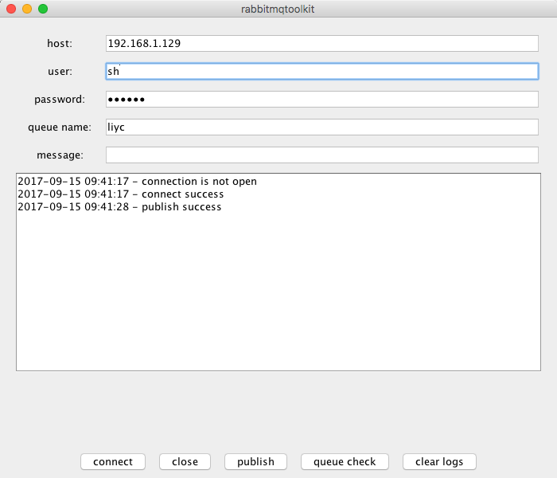

# rabbitmqtoolkit

#### introduce



this is a rabbitmq j2se tookkit for test connection, publish message and consume messages.

#### rabbitmqtoolkit.jar

Run the following command to execute 

```
java -jar rabbitmqtoolkit.jar
```

This is the latest release version to run

[rabbitmqtoolkit.jar](rabbitmqtoolkit.jar)